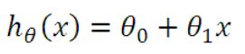
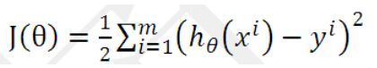
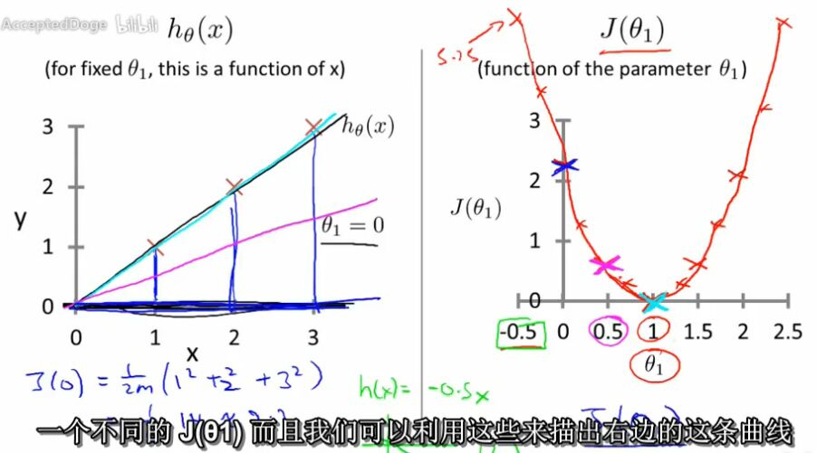
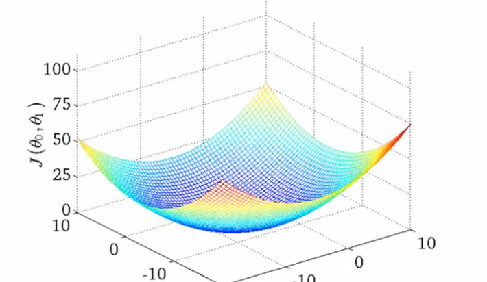
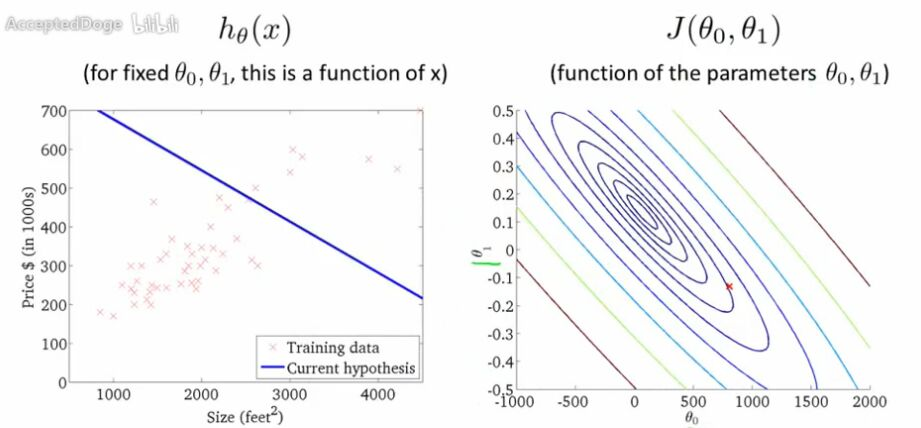
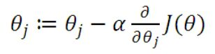
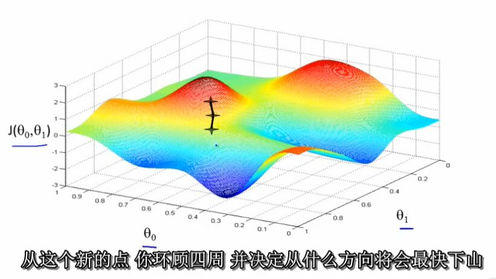
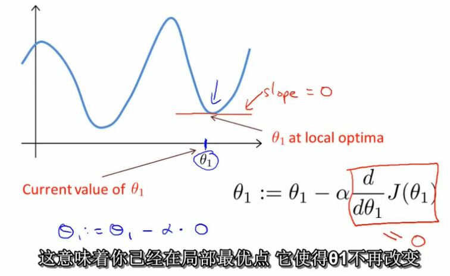
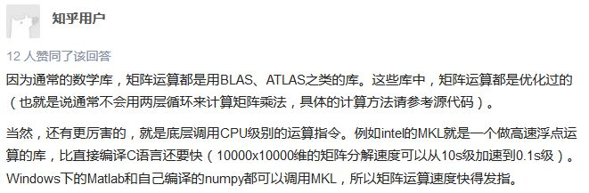

B站上看到他刚出的深度学习的视频，但是没出齐，就找了以前的这个机器学习的完整系列视频看
说实话算法这种东西我是拒绝的，毕竟高数挂科。。。
不过暂时看了4分之1都还可以，慢慢有点卡壳
也没什么，后面实在看懵逼这个笔记就太监掉都不是事
其实主要是因为隔几天没接着看我发现我忘得差不多了，毕竟没实践
那不行，不能白看，好歹记下来

ps:写完回来看，写的只能算视频内容十分之一，还是要看视频，这个就当线索帮助理解记忆。。。
然后涉及的数学暂时也只有高中的求导了，但也只需懂是求导是怎么个求导法，而不是像高考题给你很难的题去解
后面涉及的复杂点的微积分也差不多，乐观一波^^

<!--more-->
_________________
### 1.costfunction，代价函数（小标题根据B站视频标题）
用线性函数（1次幂的）模拟房价跟面积的关系，差不多就是: 
方便计算演化，会给西塔零补个x参数为1，然后变成两个参数两个系数的房价假设函数了，后续可以演化成n个参数n个系数
然后要知道这个函数跟实际数值差距有多少，就需要每个实际房价去跟假设房价（实际参数通过假设函数求得的）求差的平方再加起来再求平均值再除与2
至于为什么要这么操作，就是一个表现数据总体的差距的方式，不必深究

这个J就是代价函数costfunction也叫平方误差函数，然后求导也就能找到极值就是差距极小的时候的系数是多少了
接着用实例去讲解代价函数呈现在坐标系平面上是怎么样的，帮助理解
默认那个参数为0的时候，只有一个参数的时候，是个凹弓弧线:

再扩展下，两个系数的时候，就是很多弧线形成一个空间立体弧面:

如果放回平面坐标系去看就是一圈圈参数值形成j函数圈（想象成等高线）

空间弧面最低点就是平面圈圈图里面的中心也就是J的极小值也就是假设房价函数最接近真实房价的时候的参数

### 2.gradient descent，梯度下降算法

前面的空间弧面要找最低点，在实际操作中是从一个点开始，不停去找
想象成站在山上某一个点要找一个最陡的路径才能最快速度下去最低点就是梯度下降算法的意义:

其中阿尔法参数是学习效率也就是跟后面的微分项（一个参数时就是求导也就是斜率）一起控制下山步伐多大，所以这个参数不能太大，想象下如果一步1000米，那你假如快走到谷底了，一步过去跑另一座山去了。。。
太小不行就不用说了
另外也不用担心如果开始点就在最低点，那一步卖过去了怎么办，因为越接近最低点，微分项越接近0，再跟阿尔法参数相乘越来越小

所以就是说距离谷底越远，斜率越大，乘与阿尔法参数也越大，即是下山步子越大，但是越接近谷底，步子就越小

### 3.matrix 矩阵运算
就是个运算方式，不需要理解的
讲这个主要为了方便多个训练集的情况直接用矩阵就好，不用呆呆的去for循环
说是机器算矩阵比算for循环快，至于为什么，随手百度了下答案：

___________________________
暂时到这里，入个门^^
