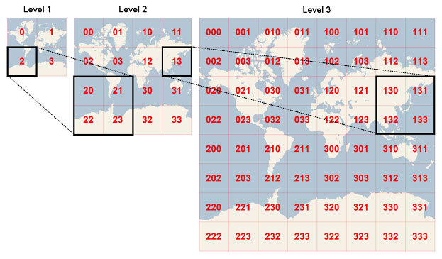

------------------
最近在弄基于百度地图控件的资源管理，每个资源有详细信息加经纬度标注，自然少不了查找附近资源这样的功能实现
正常用膝盖想那直接遍历所有点，计算跟当前位置的距离，一点难度没有
但是数据量多加搜索请求多起来的话，这么搞就效率就很LOW了
虽然我做的封闭项目并没这样的需求- -||
但是忍不住好奇找了下，发现了这个geohash算法
算法？好像很高深哟，其实并没有
逻辑简单，重在思维
<!-- more -->
------------------

简单讲就是将地球地图切为4个方格，小方格再4分

如上图，所以假如经度138.291573，纬度39.928167这样一个点
先对经度转码，只算经度的话二分就好，左边0，右边1，纬度转码类似，上边0，下边1
最后合并就跟4分效果一样

|bit |	min 	   |  mid 	     | max
|:----|:-----|:----|
|1       |-180 	        |0.000 	 |180
|1 	|0.000 	|90 	         |180
|1 	|90 	        |135 	         |180
|0 	|135 	        |157.5    	 |180
|0 	|135 	        |146.25 	 |157.5
|0 	|135 	        |140.625 	 |146.25
|1 	|135 	        |137.8125 	 |140.625
|0 	|137.8125 	|139.21875 	 |140.625
|0 	|137.8125	|138.515625 	 |139.21875
|1 	|137.8125 	|138.1640625 	 |138.515625

经度根据上面一套连招，变成 1 1 1 0 0 0 1 0 0 1
纬度同理变成 1 0 1 1 1 0 0 0 1 1
经度奇数位，纬度偶数位合并得到 11101，10101，00100，00111
5位一组29，21，4，7进行base32编码获得xp47
这样资源信息入库的时候，用多一个字段存这个码，要查xp47这个点附近的XXX，sql直接like就好

---------------------

讲到这里，其实就知道这个geohash是个什么东西
“咦，还真是，这样方便很多”
但是怎么想到呢，思维方式概括来讲是二维平面，用线去解读

看上面这个图各种路线(空间填充曲线)，都是一种解读
但是这些解读中，反映线上各个点在实际平面距离关系的效果却有所不同

上面这个图可以看出geohash用的是peano
明显的缺点是对角的地方（0011和1100）实际平面距离，线性表达上却距离很远
解决方案是找周围周围的8个格，表达方式出来了，怎么线性表达周围8格就简单了

--------------------

看下来这东西确实不复杂，但是贵在思维方式
这东西容易在日常工作生活中丧失，所以才决定记录下来，毕竟这才是乐趣所在不是？

